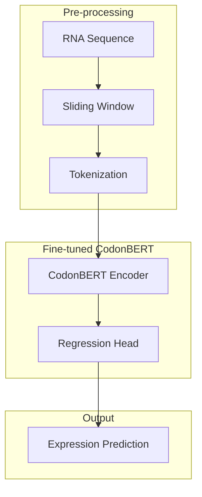

# CodonBERT for RNA Expression Prediction

This project fine-tunes CodonBERT (a pre-trained model for biological sequence analysis) to predict mRNA expression levels from RNA sequences. The system uses a sliding window approach to handle variable-length RNA sequences and adapts the CodonBERT architecture for regression tasks.

## Project Structure

```
Pre-FF/
├── create_expression_dataset.py     # Script to generate synthetic expression data
├── fine_tune_rna_elements.py        # Main script for fine-tuning CodonBERT
├── standalone_analysis.py           # Script to analyze the fine-tuned model
├── run_fine_tuning_pipeline.sh      # Shell script to run the complete pipeline
├── analyze_fine_tuned_model.py      # Script to generate metrics and visualizations
├── rna_elements_expression.csv      # Dataset with RNA sequences and expression values
├── output/                          # Directory for fine-tuned models and results
│   └── fine_tuned/
│       └── final_model/             # Final fine-tuned model
└── analysis_results/                # Analysis results
    ├── metrics.json                 # Performance metrics
    ├── predictions.csv              # Predictions vs actual values
    └── predictions_vs_actual.png    # Scatter plot of predictions
```

## Model Architecture

CodonBERT is a BERT-based model pre-trained on biological sequences. For mRNA expression prediction, we fine-tune it to learn the relationship between sequence patterns and expression levels.



## How It Works

1. **Data Preparation**:
   - RNA sequences are loaded from a CSV file with corresponding expression values
   - Sequences are processed using a sliding window approach to handle variable-length inputs
   - Each window is tokenized into k-mers (typically 3-mers: triplets of nucleotides)

2. **Sliding Window Approach**:
   - Long RNA sequences are divided into overlapping windows (default: 300 nucleotides)
   - Each window is processed independently through the model
   - Predictions for all windows from a sequence are averaged to get the final prediction

3. **Tokenization**:
   - RNA sequences are converted to k-mers (default: 3-mers)
   - Special tokens ([CLS], [SEP], [PAD]) are added
   - Custom tokenizer converts the k-mers to token IDs for model input

4. **Model Architecture**:
   - Base: CodonBERT pre-trained on biological sequences
   - Head: Regression layer to predict continuous expression values
   - Optional: LoRA (Low-Rank Adaptation) for parameter-efficient fine-tuning

5. **Training Process**:
   - Model is trained with Mean Squared Error (MSE) loss for regression
   - Data is split into training, validation, and test sets
   - Early stopping is used to prevent overfitting

6. **Evaluation Metrics**:
   - RMSE (Root Mean Square Error)
   - R² (Coefficient of Determination)
   - Pearson correlation coefficient
   - Spearman correlation coefficient

## Usage

### Creating Expression Dataset
```bash
python create_expression_dataset.py
```

### Fine-tuning CodonBERT
```bash
python fine_tune_rna_elements.py \
  --data rna_elements_expression.csv \
  --model ../model \
  --output_dir output/fine_tuned \
  --window_size 300 \
  --stride 100 \
  --batch_size 16 \
  --learning_rate 5e-5 \
  --epochs 10 \
  --target_metric expression
```

### Running the Complete Pipeline
```bash
./run_pipeline.sh
```

### Analyzing Results
```bash
python standalone_analysis.py \
  --model_dir output/fine_tuned/final_model \
  --test_data rna_elements_expression.csv \
  --output_dir analysis_results
```

## Performance

The fine-tuned model achieves the following metrics on the test dataset:

- RMSE: ~2.58
- R²: ~0.42
- Pearson correlation: ~0.71
- Spearman correlation: ~0.76

These metrics indicate that the fine-tuned CodonBERT model is effective at predicting mRNA expression levels from sequence data.

## Technical Details

### Model Parameters
- Base model: CodonBERT (BERT architecture customized for biological sequences)
- Tokenizer: Custom tokenizer for RNA sequences using 3-mers
- Optimizer: AdamW with learning rate warmup
- Batch size: 16 (default)
- Sliding window: 300 nucleotides with 100 nucleotide stride

### Installation Requirements
- Python 3.8+
- PyTorch 1.9+
- Transformers 4.15+
- Tokenizers
- scikit-learn
- Pandas
- NumPy
- Matplotlib

## Customization

The pipeline can be customized for different RNA elements or expression metrics:

- Focus on specific RNA element types (e.g., UTR, RBP binding sites)
- Predict different metrics (expression, translation efficiency)
- Adjust window size and stride for different sequence lengths
- Use LoRA for efficient fine-tuning of larger models

## Future Improvements

- Integration with more RNA sequence databases
- Multi-task learning for predicting multiple expression-related metrics
- Attention visualization to identify important regions in RNA sequences
- Cross-validation for more robust performance estimation 