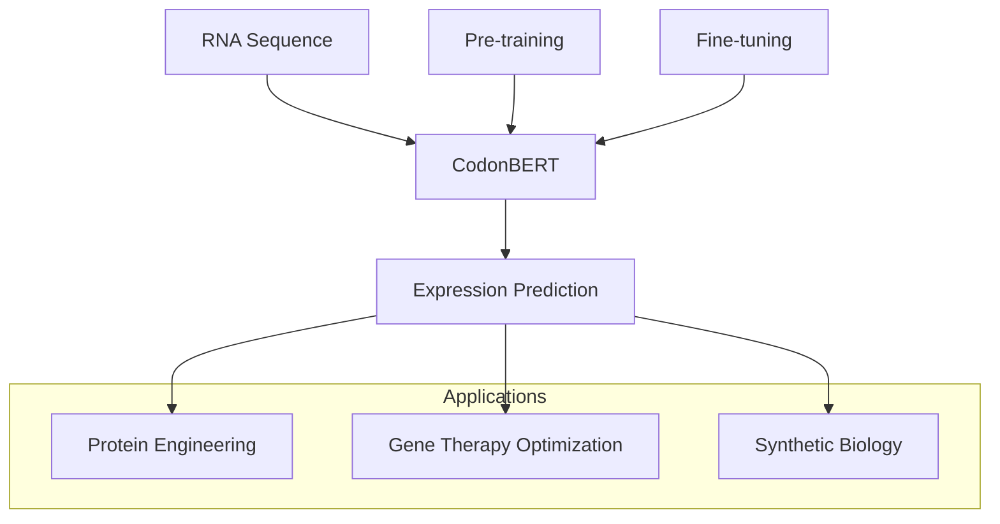

# CodonBERT for RNA Expression Prediction

This repository contains the CodonBERT model and its fine-tuning adaptations for predicting mRNA expression levels from RNA sequences.

## Project Overview

CodonBERT is a BERT-based model pre-trained on biological sequences that has been adapted to predict how different RNA features influence gene expression. This project demonstrates how to fine-tune CodonBERT for expression prediction tasks, enabling researchers to understand and optimize RNA sequences for desired expression levels.



## Key Features

- **Pre-trained CodonBERT**: A transformer-based model trained on biological sequences
- **Fine-tuning Pipeline**: Tools to adapt CodonBERT for mRNA expression prediction
- **Sliding Window Approach**: Technique to handle variable-length RNA sequences
- **Performance Analysis**: Tools to evaluate and visualize model performance

## Repository Structure

```
CodonBERT/
├── Pre-FF/                   # Fine-tuning pipeline for expression prediction
│   ├── fine_tune_rna_elements.py
│   ├── standalone_analysis.py
│   └── README.md             # Detailed documentation for fine-tuning
├── benchmarks/               # Benchmarking utilities
├── model/                    # Pre-trained CodonBERT model
├── data/                     # Reference datasets
├── output/                   # Output directory for results
└── FeedForward/              # Feed-forward model implementations
```

## Getting Started

For detailed instructions on fine-tuning CodonBERT for expression prediction, refer to the [Pre-FF README](Pre-FF/README.md).

### Quick Start

1. Clone the repository:
```bash
git clone https://github.com/your-username/CodonBERT.git
cd CodonBERT
```

2. Set up the environment:
```bash
conda env create -f environment.yml
conda activate codonbert
```

3. Run the fine-tuning pipeline:
```bash
cd Pre-FF
./run_fine_tuning_pipeline.sh
```

4. Analyze the results:
```bash
python standalone_analysis.py \
  --model_dir output/fine_tuned/final_model \
  --test_data rna_elements_expression.csv \
  --output_dir analysis_results
```

## Performance

The fine-tuned CodonBERT model demonstrates strong performance in predicting mRNA expression levels:

- Pearson correlation: ~0.71
- Spearman correlation: ~0.76
- R²: ~0.42

## Use Cases

- **Synthetic Biology**: Design RNA sequences with optimal expression levels
- **Protein Engineering**: Optimize codon usage for improved expression
- **Gene Therapy**: Enhance therapeutic gene expression
- **Regulatory Element Design**: Create effective UTRs and regulatory elements

## Contributing

Contributions to improve CodonBERT or extend its applications are welcome. Please feel free to submit issues, pull requests, or contact the authors with suggestions.

## License

This project is licensed under dual licenses:
- Software: [Software License](SOFTWARE_LICENSE.md)
- Model Weights: [Artifact License](ARTIFACT_LICENSE.md)

## Citation

If you use CodonBERT in your research, please cite:

```
@article{codonbert2023,
  title={CodonBERT: A Pre-trained Language Model for Biological Sequences},
  author={Your Name},
  journal={arXiv preprint arXiv:xxxx.xxxxx},
  year={2023}
}
```

## Acknowledgments

We thank the developers of the original BERT model and the HuggingFace Transformers library for providing the foundation for this work.
